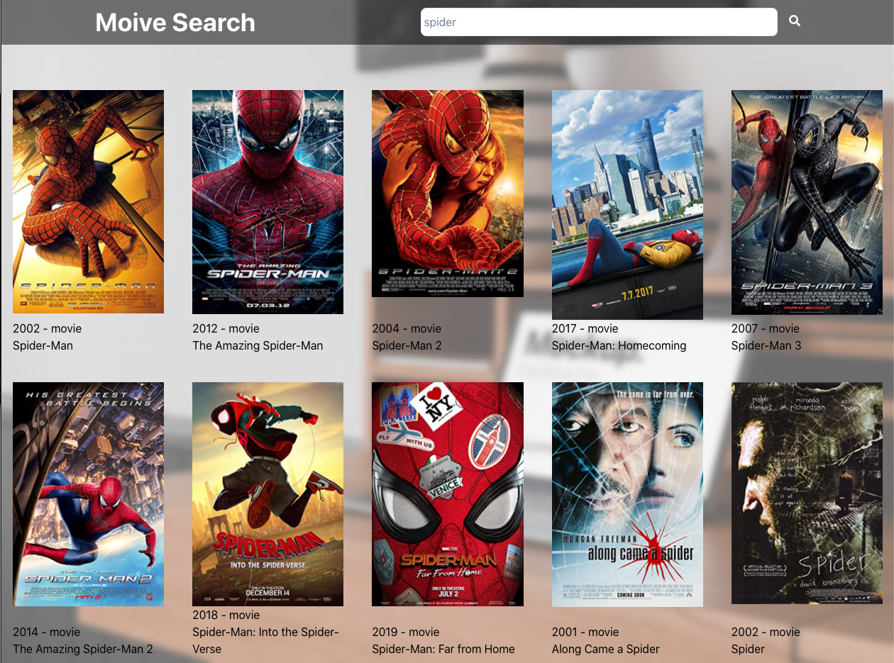

## Movie Search


---

### GIF of the application


### Application Description

The app be able to search for movies via the OMDB API.

---

- [Movie Search](#movie-search)
  - [GIF of the application](#gif-of-the-application)
  - [Application Description](#application-description)
  - [Demo](#demo)

### Demo

View the application at [here](https://movie-search.ktym4a.com/)

```Javascript
import React from 'react'
import { Link } from 'gatsby'

import { useColorMode } from 'theme-ui'
import styled from '@emotion/styled'
import { commonWidth } from '@styles/index'

const DarkModeToggle: React.FC<{}> = () => {
  const [colorMode, setColorMode] = useColorMode()
  const isDark = colorMode === `dark`

  function toggleColorMode(event: { preventDefault: () => void }) {
    event.preventDefault()
    setColorMode(isDark ? `light` : `dark`)
  }

  return (
    <IconWrapper
      isDark={isDark}
      onClick={toggleColorMode}
      data-a11y="false"
      aria-label={isDark ? 'Activate light mode' : 'Activate dark mode'}
      title={isDark ? 'Activate light mode' : 'Activate dark mode'}
    >
      <MoonOrSun isDark={isDark} />
      <MoonMask isDark={isDark} />
    </IconWrapper>
  )
}

const Header: React.FC = () => {
  return (
    <HeaderContainer>
      <HeaderWrapper>
        <HeaderText to="/">KTYM4a</HeaderText>
        <DarkModeToggle />
      </HeaderWrapper>
    </HeaderContainer>
  )
}

const HeaderContainer = styled.header`
  padding: 20px 0;
  overflow: hidden;
`

const HeaderWrapper = styled.div`
  ${commonWidth}
  position: relative;
  display: flex;
  justify-content: center;
  align-items: center;
`

const HeaderText = styled(Link)`
  color: ${(p: any) => p.theme.colors.boldColor};
  font-weight: 900;
  font-size: 5rem;
  text-align: center;
  transition: ${(p: any) => p.theme.colors.colorModeTransition};
  font-family: ${(p: any) => p.theme.fonts.montserrat};

  @media screen and (max-width: 767px) {
    font-size: 4rem;
  }
`

const IconWrapper = styled.button<{ isDark: boolean }>`
  opacity: 0.5;
  position: absolute;
  right: 6rem;
  border-radius: 5px;
  width: 40px;
  height: 25px;
  display: flex;
  align-items: center;
  justify-content: center;
  transition: opacity 0.3s ease-in-out;
  margin-left: 30px;
  &:hover {
    opacity: 1;
  }
  &[data-a11y='true']:focus::after {
    content: '';
    position: absolute;
    left: 0;
    top: -30%;
    width: 100%;
    height: 160%;
    background: rgba(255, 255, 255, 0.01);
    border-radius: 5px;
  }

  @media screen and (max-width: 767px) {
    right: 1rem;
  }
`

// This is based off a codepen! Much appreciated to: https://codepen.io/aaroniker/pen/KGpXZo
const MoonOrSun = styled.div<{ isDark: boolean }>`
  position: relative;
  width: 24px;
  height: 24px;
  border-radius: 50%;
  border: ${p => (p.isDark ? '4px' : '2px')} solid
    ${(p: any) => p.theme.colors.primary};
  background: ${(p: any) => p.theme.colors.primary};
  transform: scale(${p => (p.isDark ? 0.55 : 1)});
  transition: all 0.45s ease;
  overflow: ${p => (p.isDark ? 'visible' : 'hidden')};
  &::before {
    content: '';
    position: absolute;
    right: -9px;
    top: -9px;
    height: 24px;
    width: 24px;
    border: 2px solid ${(p: any) => p.theme.colors.primary};
    border-radius: 50%;
    transform: translate(${p => (p.isDark ? '14px, -14px' : '0, 0')});
    opacity: ${p => (p.isDark ? 0 : 1)};
    transition: transform 0.45s ease;
  }
  &::after {
    content: '';
    width: 8px;
    height: 8px;
    border-radius: 50%;
    margin: -4px 0 0 -4px;
    position: absolute;
    top: 50%;
    left: 50%;
    box-shadow: 0 -23px 0 ${(p: any) => p.theme.colors.primary},
      0 23px 0 ${(p: any) => p.theme.colors.primary},
      23px 0 0 ${(p: any) => p.theme.colors.primary},
      -23px 0 0 ${(p: any) => p.theme.colors.primary},
      15px 15px 0 ${(p: any) => p.theme.colors.primary},
      -15px 15px 0 ${(p: any) => p.theme.colors.primary},
      15px -15px 0 ${(p: any) => p.theme.colors.primary},
      -15px -15px 0 ${(p: any) => p.theme.colors.primary};
    transform: scale(${p => (p.isDark ? 1 : 0)});
    transition: all 0.35s ease;
  }
`

const MoonMask = styled.div<{ isDark: boolean }>`
  position: absolute;
  right: -1px;
  top: -8px;
  height: 24px;
  width: 24px;
  border-radius: 50%;
  border: 0;
  background: ${(p: any) => p.theme.colors.background};
  transform: translate(${p => (p.isDark ? '14px, -14px' : '0, 0')});
  opacity: ${p => (p.isDark ? 0 : 1)};
  transition: ${(p: any) => p.theme.colorModeTransition}, transform 0.45s ease;
`
export default Header
```
